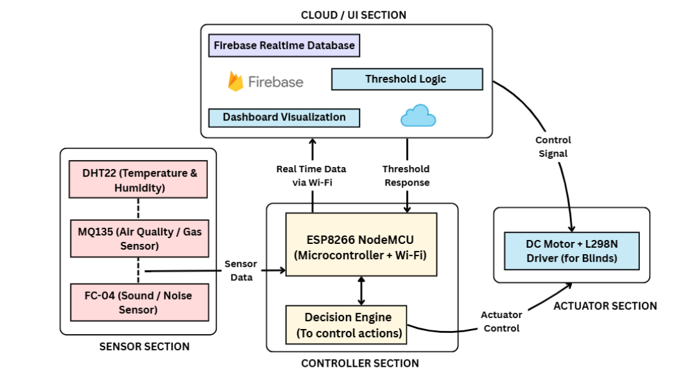

# ESP8266 IoT Environmental Monitor with Curtain Automation

## Overview

This project is an **Arduino/ESP8266-based IoT system** that monitors environmental conditions and automatically controls a curtain. It reads **temperature, humidity, air quality, and sound levels**, logs data to **Firebase Realtime Database**, and maintains historical records for analysis.  

---

## Hardware Components

| S.No | Component | Description |
|------|-----------|-------------|
| 1 | ESP8266 | Microcontroller with WiFi |
| 2 | MQ-135 | Air quality sensor |
| 3 | FC-04 | Sound detection sensor |
| 4 | DHT22 | Temperature and humidity sensor |
| 5 | 10V DC Motor | Controls the curtain |
| 6 | L298N Motor Driver | Motor driver for controlling the DC motor |

---

## System Flow (Block Diagram)

 

**Flow Description:**

1. Sensors collect environmental data:
   - DHT22 → Temperature & Humidity  
   - MQ-135 → Air Quality  
   - FC-04 → Sound levels  
2. Sensor readings are processed:
   - MQ-135 readings smoothed over multiple samples  
   - Sound triggers counted in a short window  
3. Curtain control logic:
   - Opens if temperature > 30°C  
   - Closes if temperature < 25°C  
4. Data uploaded to Firebase:
   - Realtime data under `/environment`  
   - Historical logs under `/environmentHistory/<timestamp>`  

---

## Features

- Real-time **temperature and humidity monitoring**  
- **Air quality monitoring** with smoothing for noise reduction  
- **Sound level detection** and classification  
- Automatic **curtain control** based on temperature thresholds  
- Cloud-based **Firebase logging** for realtime and historical data  

---

## How It Works

1. Sensors collect data every 2 seconds.  
2. **MQ-135 readings** are averaged over 8 samples for stability.  
3. **Sound sensor** counts trigger events to detect noise.  
4. Curtain automation:
   - Opens if temperature > 30°C  
   - Closes if temperature < 25°C  
5. Data uploaded to Firebase:
   - `/environment` → Real-time values  
   - `/environmentHistory/<timestamp>` → Historical log  
